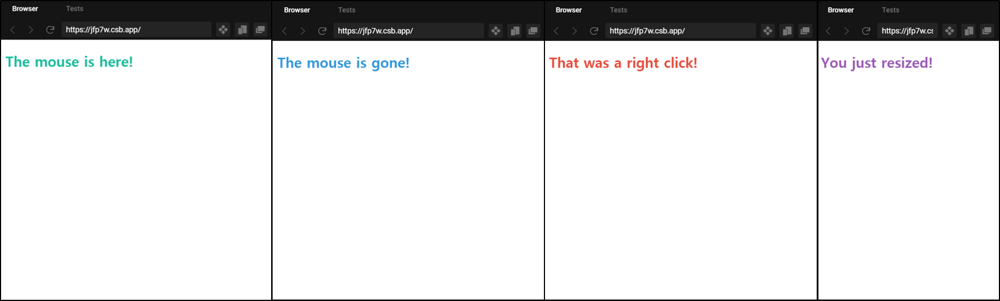
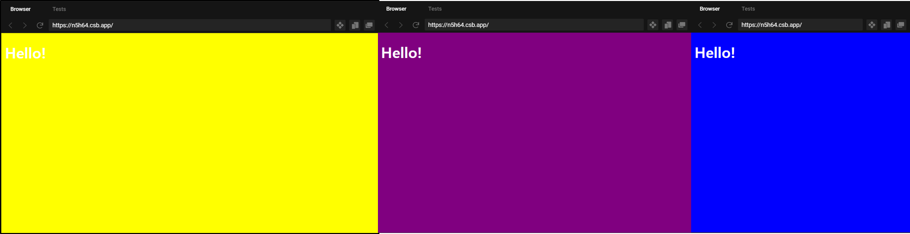
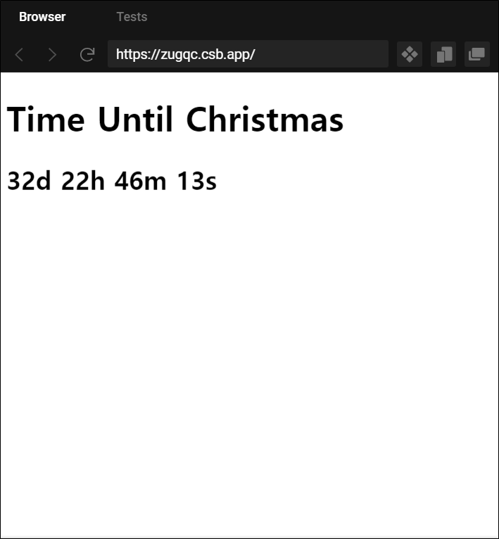
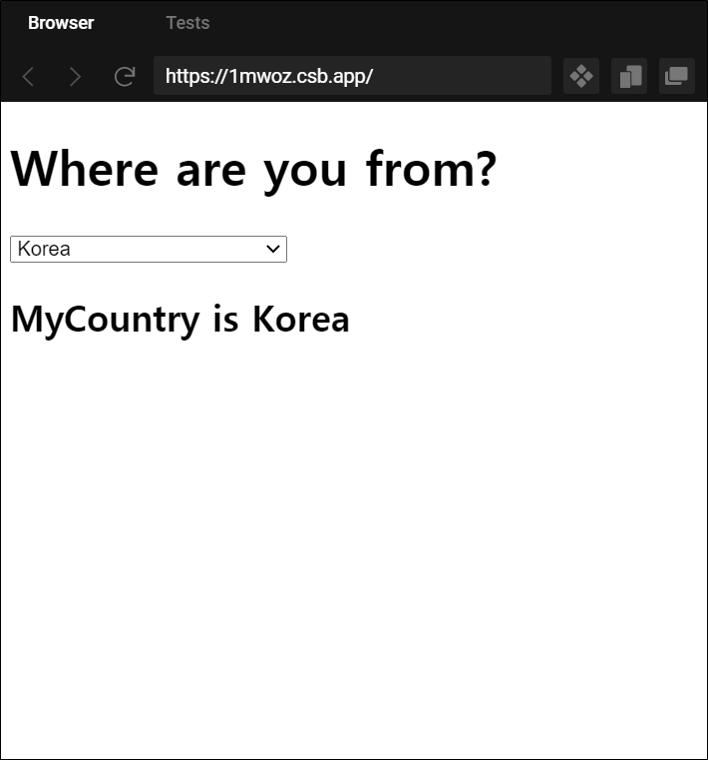
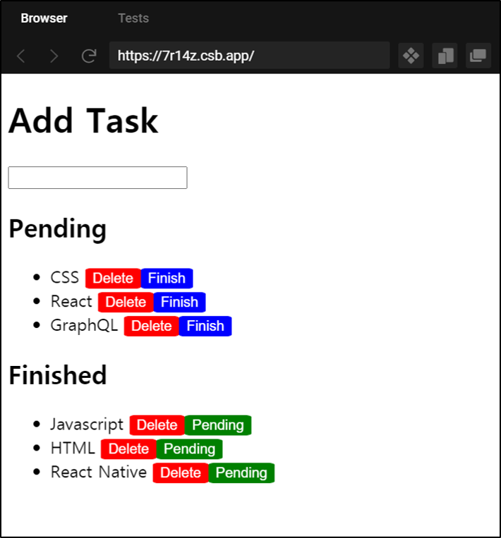
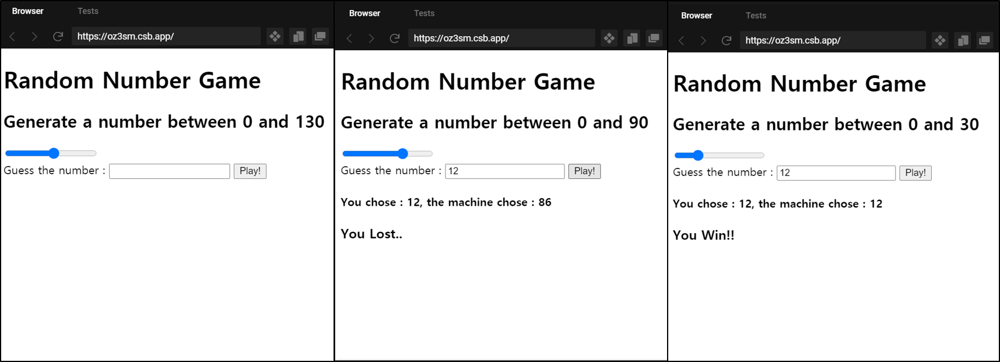
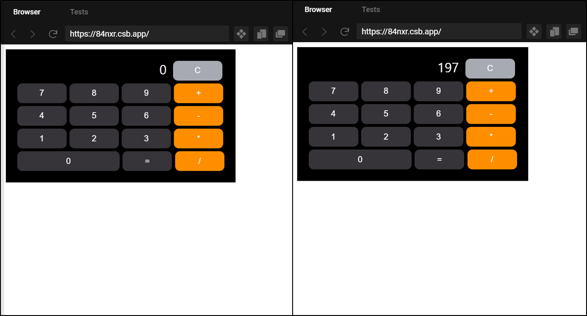
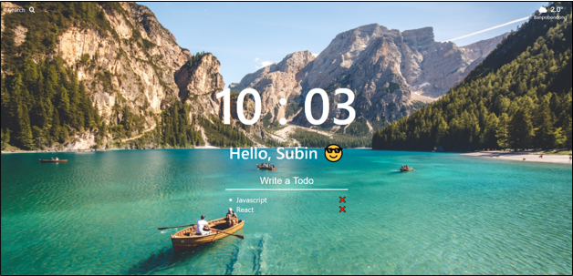

# 바닐라JS  - 크롬앱 만들기

### ✨ Chrome 웹 스토어 momentum 만들어보기 ✨ 

### 📖 코드 챌린지 1. Event & CSS_1

#### 👑 이벤트

- [x] 마우스가 이벤트 영역에 들어갔을 때.
- [x] 마우스가 이벤트 영역에서 나갔을 때.
- [x] 마우스 오른쪽 클릭을 했을 때.
- [x] 화면 크기를 변경했을 때.

#### 🎡 화면

 

#### 📌[codesandbox](https://codesandbox.io/s/day-three-blueprint-forked-jfp7w?file=/src/index.js)

### 📖 코드 챌린지 2. Event & CSS_2

#### 👑 이벤트

- [x] 화면 크기에 따라 3가지 색으로 변화.

#### 🎡 화면 

 

#### 📌[codesandbox](https://codesandbox.io/s/empty-blueprint-forked-n5h64?file=/src/index.js)

### 📖 코드 챌린지 3. Date()

#### 👑 이벤트

- [x] `Date()`를 이용하여 크리스마스까지 남은 시간 계산.

#### 🎡 화면 

 

#### 📌[codesandbox](https://codesandbox.io/s/day-five-blueprint-forked-x0di1?file=/src/index.js)

### 📖 코드 챌린지 4. Local Storage_1

#### 👑 이벤트

- [x] **localStorage**를 이용하여 **Country** 리스트를 저장.

#### 🎡 화면 

 

#### 📌[codesandbox](https://codesandbox.io/s/empty-blueprint-forked-7r14z?file=/src/index.js)

### 📖 코드 챌린지 5. Local Storage_2

#### 👑 이벤트

- [x] **localStorage**를 이용하여 **Todo** 리스트를 저장.
- [x] `Delete` 버튼을 이용하여 해당 **Todo**를 **localStorage**에서 제거.
- [x] `Finish` 버튼을 이용하여 해당 **Todo**를 **Finished**로 이동.
- [x] `Pending` 버튼을 이용하여 해당 **Todo**를 **Pending**으로 이동.

#### 🎡 화면 

 

#### 📌[codesandbox](https://codesandbox.io/s/empty-blueprint-forked-7r14z?file=/src/index.js)

### 📖 코드 챌린지 6. input range

#### 👑 이벤트

- [x] **input** 태그의 **range**타입을 이용.
- [x] 0부터 최대 범위를 지정.
- [x] 지정 범위 안에 숫자를 랜덤으로 뽑아 체크.
- [x] 해당 결과에 따라 **Win**, **Lost**를 설정.

#### 🎡 화면 

 

#### 📌[codesandbox](https://codesandbox.io/s/empty-blueprint-forked-oz3sm?file=/src/index.js)

### 📖 코드 챌린지 7. 계산기

#### 👑 이벤트

- [x] **input** 태그의 계산하려는 숫자를 이용.
- [x] 덧셈, 뺄셈, 나눗셈, 곱셈 기능.
- [x] 리셋 버튼을 이용하여 계산 과정 초기화.
- [x] 연산자가 두번이상 반복될 경우 계산 내용 표시
  - ex. 2 * 2 * 2 ...

#### 🎡 화면 

 

#### 📌[codesandbox](https://codesandbox.io/s/empty-blueprint-forked-84nxr?file=/src/index.js)

### ✔️ [졸업작품](https://souvenir718.github.io/soumentum/) ✔️ 

 

### 🏆 [Certificate](https://github.com/souvenir718/TIL/blob/master/Certificate/%EB%B0%94%EB%8B%90%EB%9D%BC%20JS%EB%A1%9C%20%ED%81%AC%EB%A1%AC%20%EC%95%B1%20%EB%A7%8C%EB%93%A4%EA%B8%B0.pdf)
